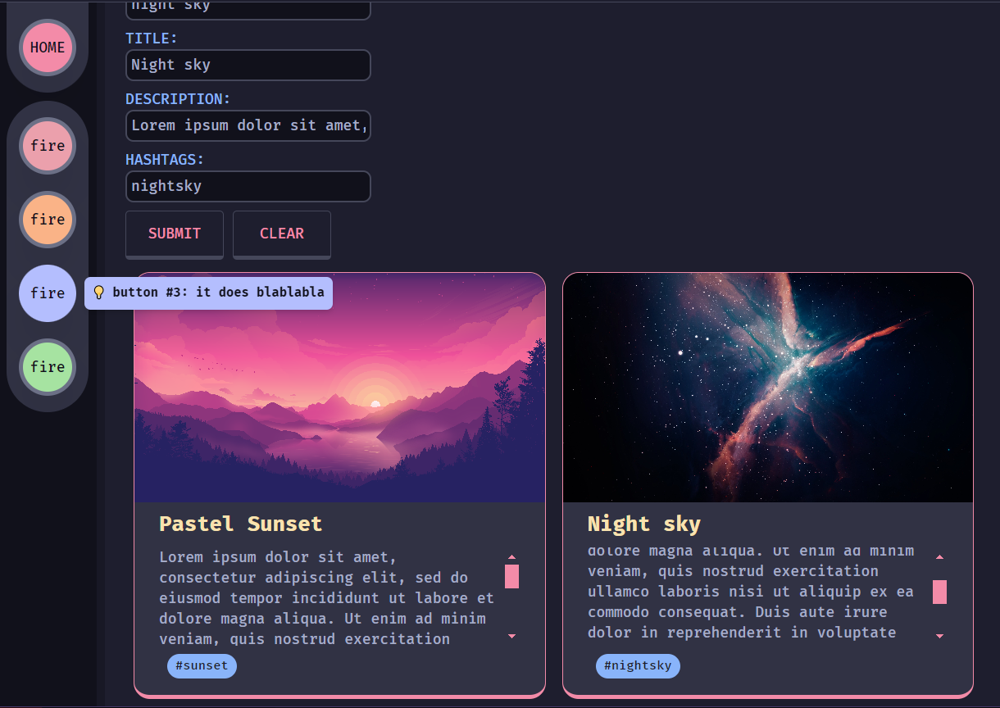

# GOTTH stack example for simple SSR website

## Go Temple + TailwindCSS + Htmx

### Go Templ

Go and Templ provide a simple way to make components that can take in arguments to make them look differently depending on the JSON sent from the frontend

### TailwindCSS

To make our app look pretty we can use tailwindcss to style everything including buttons and adding (dynamic) grids for card components we generated from the backend

### Htmx

A lightweight interaction library to make requests to the backend and swap out html content on the page, meaning we need very little JS to make things work

## Images

